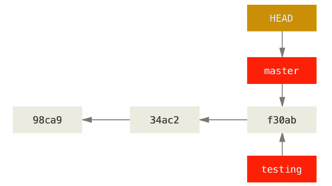

### 13 - Branchs

Por que usar branchs?

Branchs são úteis para criar novas funcionalidades, testar algum recurso sem comprometer a versão principal da aplicação, enfim para isolar novas <features> do sistema para incoporá-las assim que forem testadas.

Uma grande vantagem da branch é que você não precisa copiar nada, nem muito menos criar uma nova pasta. O git gerencia tudo para você.

O que acontece se você criar um novo branch (ramo)? 
    a. Cria um novo ponteiro para você se movimentar. 
    b. Digamos que você queira criar um novo ramo chamado testing. 
    
Você faz isso com o comando:
```
git branch testing

```
Veja a imagem 

<p align="center">
  
</p>
<p align="center">
   <strong>Figura 1-Uma típica árvore do Git com um Master, Branch e Head</strong> 
</p>
