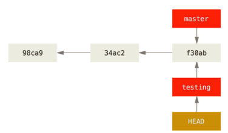
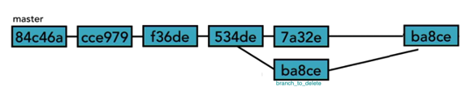

### 13 - Branchs

Por que usar branchs?

Branchs são úteis para criar novas funcionalidades, testar algum recurso sem comprometer a versão principal da aplicação, enfim para isolar novas <features> do sistema para incoporá-las assim que forem testadas.

Uma grande vantagem da branch é que você não precisa copiar nada, nem muito menos criar uma nova pasta. O git gerencia tudo para você.

O que acontece se você criar um novo branch (ramo)? 
    
    a. Cria um novo ponteiro para você se movimentar. 
    
    b. Digamos que você queira criar um novo ramo chamado testing. 
    
Você faz isso com o comando:
```
git branch testing
```
Veja a Figura 1 

<p align="center">
  
</p>
<p align="center">
   <strong>Figura 1-Uma típica árvore do Git com um Master, Branch e Head</strong> 
</p>

```
 git log --oneline
9dd3aa4 (HEAD -> master, testing) Revert "Revert "imprime a data formatada""
99fffb1 Revert "imprime a data formatada"
b7b2bf6 imprime a data formatada
fc3be9d (origin/master) Adicionado o lab2
cb0d1f5 Atualização em Arquivo 1
f5e8cb0 Adicionada mais uma linha no commit anterior
5d98f23 commit inical
```    

> Observe a linha `9dd3aa4 (HEAD -> master, testing)`

O git está dizendo que tanto o `master` quanto o `testing` estão apontando para o mesmo hash <9dd3aa4> e que o `head`está sincronizado com o `master`, ou seja, o branch `testing` foi criado mas nós não estamos granvando nele. Para isso é preciso fazer um `checkout` para esse `branch`.

#### Passando a trabalhar no novo branch
O que acontece se você quiser trabalhar no novo branch ? 
O HEAD precisa estar apontando para o novo branch. Você faz isso com o comando:

```
git checkout testing
```

Ou 

```
git checkout –b testing
```

Veja a Figura 2

<p align="center">
  
</p>
<p align="center">
   <strong>Figura 2-Uma típica árvore do Git com o Head apontando para o Branch `testing`</strong> 
</p>

#### Renomeando um Branch

Para renomear um branch usa-se o comando 

```
$ git branch --move testing teste
git log --oneline
9dd3aa4 (HEAD -> teste, master) Revert "Revert "imprime a data formatada""
99fffb1 Revert "imprime a data formatada"
b7b2bf6 imprime a data formatada
fc3be9d (origin/master) Adicionado o lab2
cb0d1f5 Atualização em Arquivo 1
f5e8cb0 Adicionada mais uma linha no commit anterior
5d98f23 commit inical
```
> Observe como o nome mudou de `testing` para `teste`

#### Como fazer para se saber quais os branchs existentes ?

É muito simples, é só digitar:
```
git branch
```
Esse comando solicita ao git que mostre os branchs e assinale com um `*` aquele para o qual aponta o `Head`.

Vejamos a resposta:

```
master
* teste
```
#### Como fazer para excluir um branch?

Para deletar um branch use a opção (-d ou –delete). Lembre-se que vc precisa estar em outro branch ou no master para executar essa operação. Se o branch a ser deletado contiver alterações em relação ao que o deu origem, o git faz um alerta. Se mesmo após o alerta você desejar excluir o branch, então use `-D` ao invés de `-d`.

```
$ git branch -d teste
error: The branch 'teste' is not fully merged.
If you are sure you want to delete it, run 'git branch -D teste'
```

Agora temos duas opções: a primeira seria realmente usar o comando com a chave -D para forçar a deleção e a segunda seria fazer primeiramente o commit no branch e, depois, possivelmente um `merge`(que falaremos logo a seguir) para deletarmos o branch.

Antes de fazermos isso, porém, vamos verificar o log:
```
git log --oneline
23f8a43 (`HEAD -> teste`) Teste de alteração para excluir o branch (1)
9dd3aa4 (`master`) Revert "Revert "imprime a data formatada" (2)
99fffb1 Revert "imprime a data formatada"
b7b2bf6 imprime a data formatada
fc3be9d (`origin/master`) Adicionado o lab2 (3)
cb0d1f5 Atualização em Arquivo 1
f5e8cb0 Adicionada mais uma linha no commit anterior
5d98f23 commit inical

```
Nesse log, temos 3 observações a fazer:

1-O `Head` esstá apontando para o branch `teste`.

2-O `master` está um commit atrás, ou seja, o branch `teste` está com um commit a mais.

3-A última vez que fizemos um `push` (enviar para o servidor remoto) foi 4 commit atrás.

Feita essas observações podemos agora fazer o delete do teste (criado apenas para demonstrar) usando a chave -D.

```
$ git checkout master  //Sai do branch teste e vai para o master
$ git branch -D teste  //Deleta o branch teste, forçando com -D
```


#### Como fazer para reintegrar um branch (fazer um merge)?

Como dissemos anteriormente a finalidade de um merge é criar um braço (ramo) do projeto principal, fazer as mudanças, testar e depois reintegrá-lo ao projeto principal.

Veja a Figura 3

<p align="center">
  
</p>
<p align="center">
   <strong>Figura 3-ma típica árvore do Git com um branch a ser reintegrado ao master</strong> 
</p>

Vamos trablahar?

1)Crie um branch  denominado `Issue#1`;

```
git branch Issue#1
git checkout Issue#1
```
2)Nesse branch, altere a classe `Arquivo2.java` para o seguinte código:

```java
package lab2;

import java.text.DateFormat;
import java.text.SimpleDateFormat;
import java.util.Date;

public class Arquivo2 {
    public static void main(String[] args) {
        DateFormat dateFormat = new SimpleDateFormat("dd/MM/yyyy HH:mm:ss");
        Date date = new Date();
        //Imprime a data formatada
        System.out.println("Hoje é "+dateFormat.format(date));
        int a = 5;
        int b = 10;
        System.out.println("a+b="+(a+b));
}
}
```

3)Commit essas mudanças;

```
git commit -am"Feitas as alterações da issue # 1 "
```

4)Vá para o master e certifique-se que essas mundanças ainda não estão no Arquivo2.java daquele branch (o master);

```
git checkout master
```
> As mudanças ainda não foram aplicadas ao `master`

5)Faça o merge do branch `Issue#1` com o master;

```
git merge Issue#1
```


6)Verifique se as mudanças foram incorporadas  ao `Arquivo2.java` do master.

```
> Ok. As mudanças foram aplicadas ao `Arquivo2.java` do master

7)Exclua o branch Issue#1
```
git branch -d Issue#1
```


