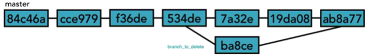

### True Merge

Na lição 13 mostramos o merge fast forword, ou merge automático. Esse merge é realizado pelo prórpio git pois não há conflito entre as versões que estão sendo "mergeadas". 

O conflito ocorre quando, após a criação do branch (que será reintegrado) o master sofre alguma alteração e essa alteração "conflita" com a alteração que foi realizadas no branch.


Observe a Figura 1

<p align="center">
  
</p>
<p align="center">
   <strong>Figura 1- Um exemplo de conflito que pode necessitar de um TrueMerge</strong> 
</p>

Na Figura 1, o branch foi criado a partir do hash `534de`. Depois que o branch foi criado, outros commits foram realizados no master (3 para ser mais exato) e o merge será realizado no commit `ab8a77`. Se no commit `ab8a77` houver conflito com o branch, o git nos informa disso e temos que resolvê-lo manualmente.

Vamos fazer um exemplo e tudo ficará mais claro.

1-A partir dos commits abaixo, crie um novo branch

```
63438df (HEAD -> master) Alterado o arquivo2.java Issue#1
9dd3aa4 (origin/master) Revert "Revert "imprime a data formatada""
...
5d98f23 commit inical
```

```
git branch teste
```
2-Agora temos um master e um branch exatamente iguais.

3-No master atere o `Arquivo2.java` para:

```java
package lab2;

import java.text.DateFormat;
import java.text.SimpleDateFormat;
import java.util.Date;

public class Arquivo2 {
    public static void main(String[] args) {
        DateFormat dateFormat = new SimpleDateFormat("dd/MM/yyyy HH:mm:ss");
        Date date = new Date();
        //Imprime a data formatada
        System.out.println("Hoje é "+dateFormat.format(date));
        int a = 50; //Alterado aqui
        int b = 100; //Alterado aqui
        System.out.println("a+b="+(a+b));
     }
}
```
4-Salve o arquivo e commit no master.

```
git commit -am"Alterado o Arquivo2.java no master"
```


5-No branch `teste` atere o `Arquivo2.java` para:

```
git checkout teste
```


```java
package lab2;

import java.text.DateFormat;
import java.text.SimpleDateFormat;
import java.util.Date;

public class Arquivo2 {
    public static void main(String[] args) {
        DateFormat dateFormat = new SimpleDateFormat("dd/MM/yyyy HH:mm:ss");
        Date date = new Date();
        //Imprime a data formatada
        System.out.println("Hoje é "+dateFormat.format(date));
        int a = 500; //Alterado aqui
        int b = 1000; //Alterado aqui
        System.out.println("a+b="+(a+b));
     }
}
```

6-Salve o arquivo e commit no teste.

```
git commit -am"Alterado o Arquivo2.java no teste"
```

7-Vá para o master, para fazer o merge. Observe que haverá um conflito pois o mesmo arquivo foi alterado nas duas versões nas mesmas linhas. Observe

```
get checkout master
git merge teste
```

```
Auto-merging lab2/Arquivo2.java
CONFLICT (content): Merge conflict in lab2/Arquivo2.java
Automatic merge failed; fix conflicts and then commit the result.

<<<<<<< HEAD
        int a = 50;
        int b = 100;
=======
        int a = 500;
        int b = 1000;
>>>>>>> teste
        System.out.println("a+b="+(a+b));
```
O que o git está mostrando é o seguinte:

O `HEAD` (ou seja a versão que estamos, `master`) contém :
```
         int a = 50;
         int b = 100;
```         

e o teste (Incoming Change,ou a mudança que está entrando) contém:
```
         int a = 500;
         int b = 1000;
``` 

> Agora você tem que decidir quais são as linhas corretas. As opções são as seguintes: 1-Deixar o master como está, rejeitando o teste, 2-Aceitar o teste sobregravando o master e 3-Um mix das duas opções anteriores.

A título de exemplo, vamos considerar que o teste é que está correto. Para isso, apague o trecho de código:

```
<<<<<<< HEAD
        int a = 50;
        int b = 100;
=======
>>>>>>> teste
```
8-Faça o commit que foi interrompido no merge, mostre o log e exclua o teste

```
git commit -m"merge com teste"
git log --oneline
git branch -d teste

0d17d3d (HEAD -> master) Merge
eef645b Alterado o Arquivo2.java no branch teste
f36b41b Alterado o Arquivo2.java no master
...
5d98f23 commit inical
```

Viu como é tranquilo!

É isso, por hoje é só.


