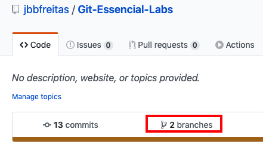
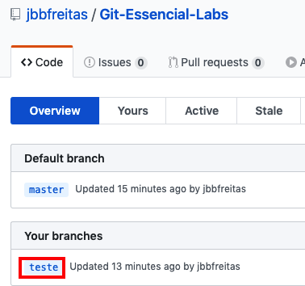
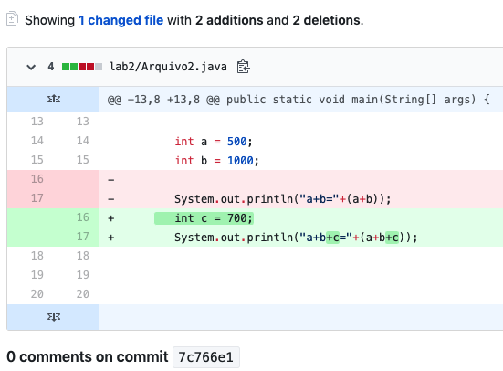

### 15- Remotes

Até aqui, tudo o que fizemos foi no repositório local, ou seja, nós não compartilhamos o nosso trabalho com ninguém que esteja remotamente localizado.

Ora, a principal finalidade do Git é, justamente, compartilhar informação com outros membros da equipe,  os quais,  não estão utilizando a nossa estação de trabalho  e que, por essa razão, não tem acesso ao nosso trabalhao.

Logo, a pergunta que se faz neste momento é: "Como compartilhar o nosso trabalho com toda a equipe, usando o Git? "

A resposta é muito simples: "usando um servidor de git que esteja em um local remoto mas ao mesmo tempo acessível às pessoas que irão usufruir do nosso trabalho".

Esse é o conceito que está por tras do "Git Remoto".

#### O que vem a ser um git remoto?

É um servidor qualquer que tenha o git instalado com uma pasta onde o git esteja iniciado (lembra-se do `git init` ?) e que permite que façamos todas ou algumas operações disponibilizadas pelo git (`commit`, `pull`, `push`, `fetch` etc). 

Isso significa que se quiséssemos poderíamos usar um servidor de arquivos remoto e via qualquer protocolo de rede : `ftp`, `http`, `www`, `Telnet`, `ssh` etc , acessar esse servidor para usar as funcionalidades do git remoto.

Para não reinventar a roda, entretanto, usaremos um servidor bastanrte conhecido, eficiente e, principalmete, gratuito: o servidor `github.com`.

Se vc já tem uma conta no github, ótimo poderá utilizá-la nesta lição, mas se ainda não tem crie-a agora em https://github.com/

Com a sua conta do github criada, crie um repositório e copie o endereço do repositório, algo como : `https://github.com/seuLogin/seuRepositorio.git`

#### O que é um repositório do github? . 

Um repositório nada mais é do que uma pasta denominada `seuRepositorio.git` onde está iniciado um servidor git e onde você irá fazer operações remotas usando o git. Nesse caso o protocolo utilizado para se comunicar com o servidor é o https. Simples assim.

Bom, agora que você já tem um git remoto, falta dizer como fazer para informar ao git local ( que estamos usuando para fazer os laboratórios) o endereço do git remoto. Isso é simples, basta usar o comando abaixo?

```
git remote add origin `https://github.com/seuLogin/seuRepositorio.git`
```
Esse comando do git está fazendo a ligação entre o git local e o git remoto.

Agora digte:

```
git remote
```
Se estiver usando o Mac ou o Linux, digite

```
cat .git/config
```
Ou se estiver usando o Windows, digite:

```
type .git\config
```
Esse comando exibe o conteúdo do arquivo Config

```
[core]
	repositoryformatversion = 0
	filemode = true
	bare = false
	logallrefupdates = true
	ignorecase = true
	precomposeunicode = true
[remote "origin"]
	url = https://github.com/seuLogin/seuRepositorio.git
	fetch = +refs/heads/*:refs/remotes/origin/*
[branch "master"]
	remote = origin
	merge = refs/heads/master
```
#### Enviando dados para o git remoto

Digite:

```
git push -u origin master
```

Aqui, dependendo do caso o sistema operacional poderá solicitar o seu usuário e senha do github.

Se tudo funcionar corretamente você reberá um resultado que se parece com o seguinte:

```
 git push -u origin master
Enumerating objects: 19, done.
Counting objects: 100% (19/19), done.
Delta compression using up to 12 threads
Compressing objects: 100% (12/12), done.
Writing objects: 100% (16/16), 1.37 KiB | 1.37 MiB/s, done.
Total 16 (delta 5), reused 0 (delta 0)
remote: Resolving deltas: 100% (5/5), completed with 1 local object.
To https://github.com/seuLogin/seuRepositorio.git
   9dd3aa4..0d17d3d  master -> master
Branch 'master' set up to track remote branch 'master' from 'origin'.
```
#### Exiibindo os branchs local e remoto

Para exibir todos os branchs existentes no repositório local e remoto, digite:

```
git branch -a
```

#### Como criar um branch remoto

Imagine que você esteja participando de um grande projeto e o líder da equipe pediu a você uma nova funcionalidade, digamos, resolver uma issue.

Tudo o que você não quer é fazer essa mudança diretamente no master, não é mesmo?

Então você vai fazer isso exatamente em uma branch e como você, provavelmente, não poderá  fazer o merge (veremos mais adiante qual é a boa prática nesse caso), você terá que fazer um commit em branch remoto para que alguém (com o papel de `Mantainer`) faça o merge. Lembre-se você é um `Contributor`.

Como fazer então?

Vamos fazer um passo a passo:

1. Crie um branch local

```
git branch teste
 ou 
git checkout -b teste
```

> Esta última forma `git checkout -b teste` é um dois em um: cria o branch e faz o checkout para esse branch

2. Faça a seguinte alteração em `Arquivo2.java`

```java
package lab2;

import java.text.DateFormat;
import java.text.SimpleDateFormat;
import java.util.Date;

public class Arquivo2 {
    public static void main(String[] args) {
        DateFormat dateFormat = new SimpleDateFormat("dd/MM/yyyy HH:mm:ss");
        Date date = new Date();
        //Imprime a data formatada
        System.out.println("Hoje é "+dateFormat.format(date));

        int a = 500;
        int b = 1000;
        int c = 700; //Alterado aqui
        System.out.println("a+b+c="+(a+b+c)); //Alterado aqui
 
    }
}

```
3. Faça o commit no branch teste

```
git commit -am"Acrescentada a variável c"
```

4. Faça o push no branch remoto teste

```
git push origin teste
```
>Esse comando cria um branch remoto, denominado teste, e copia (faz o push) de todo o repositorio local do branch teste para o repositório remoto do branch teste. 

5. Veja como fica o github depois desta última operação.

<p align="center">
  
</p>
<p align="center">
   <strong>Figura 1- O repositório remoto após a criação do branch remoto</strong> 
</p>

6. Clique no botão destacado na Figura 1.

7. Em seguida clique no link destacado na Figura 2.

<p align="center">
  
</p>
<p align="center">
   <strong>Figura 2- Verificando o seu branch remoto `teste`</strong> 
</p>

8. Depois clique na mensagem do seu commit "Acrescentada a variável c". Você deverá ver uma imagem parecida com a da Figura 3.

<p align="center">
  
</p>
<p align="center">
   <strong>Figura 3- Mostrando a mudança no arquivo</strong> 
</p>


