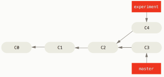
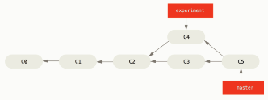
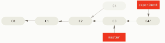
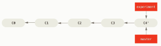

### 16- Outros Recursos do Remote

#### Push

O `push` serve para enviar os dados do(s) commit(s) ao repositório remoto.

Antes de usar o "git push", verifique se você está no branch local correto usando um check-out. Em seguida, para executar o envio, basta especificar para qual branch remoto você deseja enviar. 
Por exemplo, se você estiver trabalhando em uma branch denominada `develop`, então poderia usar:

```
git checkout develop
git push origin develop

```
Se você estiver publicando um repositório local pela primeira vez em um repositório remoto, a opção "-u" deverá ser utilizada. Ela garante que uma conexão entre os repositórios remoto e local seja estabelecida:

```
git push -u origin develop
```
Depois de configurar uma conexão, você poderá executar futuros envios sem fornecer opções adicionais - já que a conexão usará valores padrão para o comando push, assim basta digitar:

```
git push 
```

#### Pull e Fetch

O `pull` e o `fetch` são parecidos porém com funcionalidades distintas. Antes de falarmos sobre as diferenças entre esses dois comandos, destacamos suas semelhanças: ambos são usados ​​para baixar novos dados de um repositório remoto.

Fazer o download de dados é uma etapa essencial no seu trabalho diário - porque os dados remotos que você está vendo no seu repositório local são apenas um "instantâneo". Os dados foram atualizados  a última vez em que você baixou explicitamente usando `fetch` ou `pull`. É essencial ter esse fato em mente ao inspecionar branchs remotos!

Vejamos agora as diferenças, mais importantes, entre `fetch` e `pull`.

O `git fetch` realmente baixa apenas novos dados de um repositório remoto - mas não integra nenhum desses novos dados aos seus arquivos de trabalho. O `fetch` é excelente para obter uma nova visão de todas as coisas que aconteceram em um repositório remoto.
Devido à sua natureza "inofensiva", você pode ter certeza: o `fetch` nunca manipulará, destruirá ou estragará nada. Isso significa que você pode e deve usá-lo quantas vezes quiser sem o menor receio.
Sintaxe:

```
git fecth origin
```
Observações:

- O fetch não altera o master, apenas altera o origin/master
- Por isso deve-se adotar as seguintes práticas:
    - Faça o fetch antes de começar a trabalhar
    - Faça o fetch antes de fazer um push
    - Faça o fetch sempre
    - Para sincronizar é preciso fazer um merge

Lembre-se desta equação:

`git pull = git fetch + git merge`


O `git pull`, por outro lado, é usado com um objetivo diferente em mente: atualizar o HEAD de seu branch com as alterações mais recentes do servidor remoto. Isso significa que o `pull` não baixa apenas novos dados; ele também os integra diretamente aos seus arquivos de  trabalho atuais. Isso tem algumas consequências:

> Como o "git pull" tenta mesclar alterações remotas com as locais, pode ocorrer um chamado "conflito de mesclagem". Confira a lição  [14-Fazendo um true merge](../14-TrueMerge/README.md) sobre como lidar com conflitos de mesclagem para obter mais informações.

Como em muitas outras ações, é altamente recomendável iniciar um "git pull" apenas com uma cópia de trabalho limpa. Isso significa que você não deve ter nenhuma alteração local não confirmada (comitada) antes de executar. Use o recurso `stash` do Git para salvar suas alterações locais temporariamente.(Mais tarde falaremos do `stash`)

Sintaxe:

```
git pull origin develop
```

#### Clone

O comando "clone" baixa um repositório Git existente no seu computador local.

Você terá uma versão local completa desse repositório Git e poderá começar a trabalhar no projeto.

Normalmente, o repositório "original" está localizado em um servidor remoto, geralmente de um serviço como GitHub, Bitbucket ou GitLab). O URL desse repositório remoto é posteriormente chamado de "origin".

Opções importantes
<repositório>
Especifica a URL do repositório remoto. Normalmente, isso apontará para um servidor remoto, usando um protocolo como HTTP, HTTPS, SSH ou GIT.

<diretório>
O nome da pasta na sua máquina local para a qual o repositório será baixado. Se essa opção não for especificada, o Git simplesmente criará uma nova pasta com o nome do repositório remoto.

--recurse-submódulos
Clona e inicializa todos os submódulos contidos. Se o seu projeto contiver submódulos, o uso desse parâmetro garantirá que todos os submódulos sejam clonados e inicializados depois que o projeto principal tiver sido clonado. Isso evita que você precise inicializar e atualizar manualmente os submódulos posteriormente.

Exemplos:

Neste exemplo simples (mas o mais usual), apenas a URL do repositório é especificada:

```
cd pasta/para/receber/clone
git clone https://github.com/seuLogin/seuRepositorio.git
```

Este comando fará o `download` do projeto para uma pasta especificada com o nome `seuRepositorio`. Se desejar clonar para uma pasta diferente, simplesmente especifique o nome da pasta de destino como último parâmetro.

```
git clone https://github.com/seuLogin/seuRepositorio.git
```
#### Fluxo de trabalho para o uso do git

Papel: Colaborator

Suponha que você esteja desenvolvendo um aplicativo web e deseja criar um formulário para que os usuários do aplicativo possam dar um "fedd-back".

Veja o que deveria fazer:

```
git checkout master
git fetch // o pull poderia ser usado aqui
git merge origin/master // dispensada se usar o pull
git checkout -b feedback_form //cria o branch 
git add feedback.html //adiciona o formulário ao stagin
git commit -m "Adicionado o formulário de feedback"
git fetch //Verifica se houve mudança no repo remoto. Se sim tem que fazer o merge
git push -u origin feedback_form //envia para o branch remoto
```

#### Stash

O Stash (esconderijo) é uma espécie de "área de transferência" para suas alterações locais: salva todas as alterações não confirmadas e deixa sua cópia de trabalho em um estado limpo. Você pode restaurá-lo mais tarde, a qualquer momento.

##### Quando usar o stash? 
No seu trabalho diário, muitas vezes você precisará obter rapidamente uma cópia de trabalho limpa. Isso é aconselhável (ou mesmo necessário) antes de alternar `branchs`, executar um `pull`, `merge`, `rebase` ou `cherry pick`. Em vez de comprometer o trabalho pela metade, você pode usar o `Stash` para armazenar com segurança suas alterações locais temporariamente.

Você pode criar quantos `Stashes` quiser e restaurá-los quando e onde quiser (independentemente da ramificação atual).

::: :pushpin: Importante :::

>Por favor, seja cuidadoso!
Armazenar arquivos não rastreados, o Git pode remover arquivos e pastas ignorados como um efeito colateral indesejado! Isso depende de como exatamente a regra de ignorar está modelada: uma pasta que foi ignorada com /pasta-ignorada/* **será removida** após armazenar arquivos não rastreados. Por outro lado, se a regra de ignorar for /pasta-ignorada, o Git não a limpará.
Observe que esse comportamento (definitivamente discutível) faz parte do Git.

Exemplo de como usar o stash

```
$ git status
On branch teste
Changes not staged for commit:
  (use "git add <file>..." to update what will be committed)
  (use "git checkout -- <file>..." to discard changes in working directory)

	modified:   lab2/Arquivo2.java
```

Observe que existem alterações não commitadas. A cópia de trabalho não está limpa.

Vamos então usar o `stash` a nosso favor.

```
git stash
 $ git stash
Saved working directory and index state WIP on teste: 7c766e1 Acrescentada a variável c
```

Agora vamos ver o status

```
$ git status
On branch teste
nothing to commit, working tree clean
```

E se quisermos recurperar o stash?

Vamos primeiro verificar quantos stash temos:

```
git stash list
stash@{0}: WIP on teste: 7c766e1 Acrescentada a variável c
stash@{1}: WIP on master: fc3be9d Adicionado o lab2

```
O stash que queremos recuperar é o stash@{0}, correto?

```
git stash apply stash@{0}
On branch teste
Changes not staged for commit:
  (use "git add <file>..." to update what will be committed)
  (use "git checkout -- <file>..." to discard changes in working directory)

	modified:   lab2/Arquivo2.java
```

#### Rebase

No git há duas maneiras de integrar as mudanças, uma delas é o `merge`, já estudado  nas lições [13-Branchs](../13-Branchs/README.md) e [14-Fazendo um true merge](../14-TrueMerge/README.md) e a outra é usar o poderoso comando `rebase`.

Para melhor entender o `rebase`, vamos recapitular o que acontece quando fazemos um `merge`.


<p align="center">
  
</p>
<p align="center">
   <strong>Figura 1- Uma árvore do git com um master e um branch</strong> 
</p>

Quando fazemos o merge o que o git faz é o seguinte: cria um novo commit `C5`, mesclando o conteúdo de `C3` com `C4`. Veja a Figura 2. Observe que o commit `C5`aponta para `C4`e `C3`, ou seja, foi originado da mesclagem desses dois commits

<p align="center">
  
</p>
<p align="center">
   <strong>Figura 2- Uma árvore do git com um master e um branch após o merge</strong> 
</p>

Entretanto há uma outra maneira de reintegrar as mudanças: é possível incorporar as mudanças feitas no commit `C4` diretamente no commit `C3`. Na linguagem do git isso é denominado `rebase`.

Para fazer o rebase, seria necessário:

```
git checkout experiment //mudar para o branch `experiment`
git rebase master // fazendo o rebase com o master
```


<p align="center">
  
</p>
<p align="center">
   <strong>Figura 3- Uma árvore do git com um master e um branch após o rebase</strong> 
</p>

O commit `C4'` contém `C4` e `C3`.

Após o rebase fazer o merge do teste a partir do master

```
git checkout master
git merge experiment
```

Veja como fica a árvora agora, Figura 4.

<p align="center">
  
</p>
<p align="center">
   <strong>Figura 4- Uma árvore do git com um master e um branch após o merge</strong> 
</p>

Uma das vantagens do rebase frente ao merge é que nesse caso, quando vc fizer o push o lider da equipe ou o
`mantainer` não precisará fazer o `true merge` apenas o `fast-forward`.

#### Cherry pick

Cherry-picking é um comando do git que permite ao usuário escolher os commits que deseja mandar à uma branch. Assim, ele pode analisar os commits em outra branch do repositório e escolher aquelas que são úteis para ir para sua branch.

É um comando útil, pois permite a adição de apenas commits importantes, evitando commits que estão sem testes ou que contém erros. Além disso, esse comando auxilia no desenvolvimento de softwares colaborativos, visto que vários usuários mandam alterações no código a todo momento. Usando o cherry-picking, é possível escolher os commits relevantes e de qualidades dos colaboradores, para depois levá-los às branchs principais, como a master.

Exemplo:

Suponha que haja um commit no master que você deseja trazer para a sua branch teste. Esse commit é o `d534af7`, por hipótese.

Então para incorporar esse commit à sua branch faça:

```
git checkout teste
git cherry-pick "d534af7"
```

Claro que podem haver conflitos, mas isso vc já sabe como resolver. 

Por hoje é só.

Próximo Passo [17-Melhores Práticas](../17-MelhoresPraticas/README.md)


