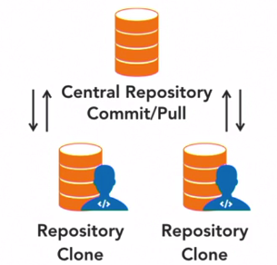
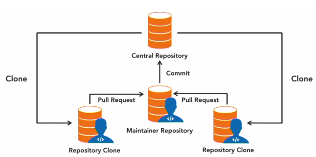
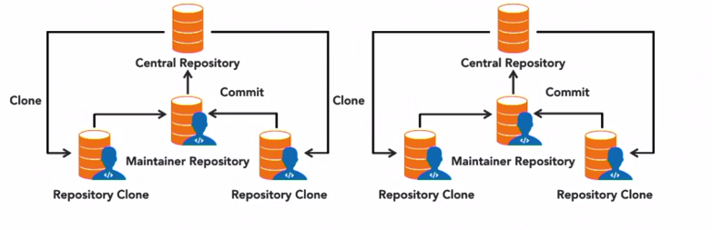
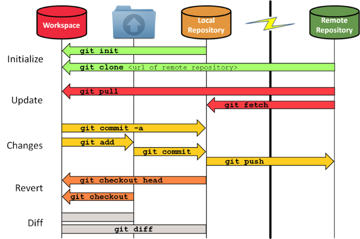
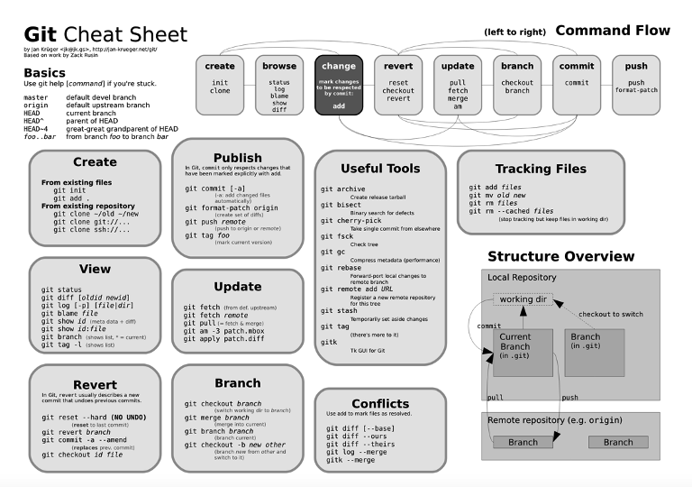

### 17- Melhores Práticas

#### Composição do Time

##### Papéis

1. Maintainer (Mantenedor)

- Profissional responsável por manter o repositório remoto do git
- Responsabilidades:
    -   Executa os commits, após a realização dos testes
    -   Integra os pull request
    -   Possui todas as permissões que possue o contribuidor e mais algumas

2. Contributor (Contribuidor)

- Profissional, geralmente um desenvolvedor, que contribui com o projeto, enviando novas funcionalidades e/ou fazendo atualizações ou correções de bugs. Esse profissional submete os seus commits que são convertidos em pull request.
- Responsabilidades:
    -   Clonar o repositorio remoto em um repositório local
    -   Não faz commit no repositório remoto
    -   Submete pull requests

##### Tamanho das equipes
1. Pequena - 1 a 2 membros
2. Média - 5 a 9 membros
3. Grande - +9 membros

##### Recomendação para times pequenos

1. Todos os membros do time podem ser colaboradores
2. Todos os membros tem acesso de leitura e gravação aos repositórios
3. Condizem uma revisão de código sempre que possível

  

   <strong>Figura 1- Responsabilidades em times pequenos</strong> 

##### Recomendação para times médios

1. Eleger um mantenedor
2. Todos os outros membros do time podem ser colaboradores
3. Mantenedor faz revisão de código sempre que possível
4. Pull requests são feitos para um repositório Intermediário
5. Somente o Mantenedor tem acesso ao repositório central

  

   <strong>Figura 2- Responsabilidades em times Médios</strong> 

##### Recomendação para times grandes

1. Eleger no mínimo 2  mantenedores
2. Todos os outros membros do time podem ser colaboradores
3. Mantenedor faz revisão de código sempre que possível
4. Pull requests são feitos para um repositório Intermediário
5. Somente o Mantenedor tem acesso ao repositório central

  

   <strong>Figura 3- Responsabilidades em times Grandes</strong> 

##### Boas práticas

- Mantenha  repositórios separado:
- Crie Normas para contributors
- Crie Normas para maintainers
- Crie Padrões de codificação
- Estabeleça Forum de discussão
- Proporcione Chats

Um bom exemplo:
https://github.com/zendframework/maintainers

##### Sequencia padrão do uso do git

  

   <strong>Figura 4- Diagrama de Sequencia do Git</strong> 

##### Git Cheat Sheet

  

   <strong>Figura 5- Folha de Resumo do Git</strong> 

