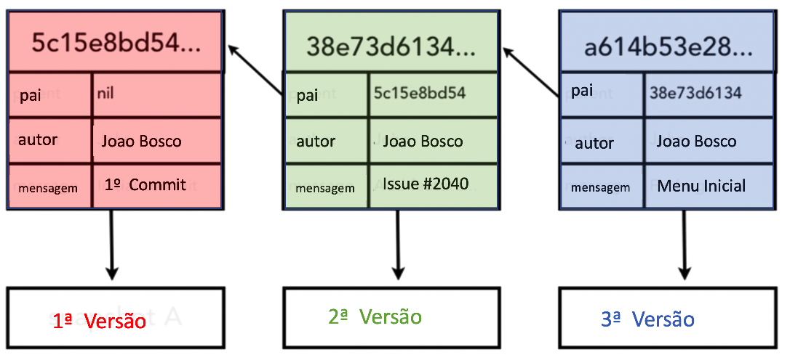

### 7.Arquitetura do GIT

Peço que você se detenha o quanto for necessário nesse tópico, pois é aqui que a maioria das pessoas tropeça no uso do Git.

#### 7.1 Arquitetura de 3 árvores (Three tree architecture)


Veja a figura abaixo:


<p align="center">
  
</p>
<p align="center">
   <strong>Figura 1- Arquitetura de 3 árvores do Git</strong> 
</p>

Como o próprio nome já diz o Git trabalha não apenas com uma árvore, mas com 3! Vamos detalhar isso.

O que significa o nome das árvores: "Working", "Stagin index" e  "Repository" ? 

Antes de explicar o significado de cada um deles vamos supor que você tenha criado um arquivo denominado `file.txt`. A  explicação do significado de cada árvore será dada em função do estado desse arquivo em cada uma das árvores. 

#### 7.1.1-Working
Na árvore `Working` o arquivo `file.txt` está sendo editado, ou seja, o `Working` é o ambiente de trabalho e contém sempre a versão mais recente do arquivo.


#### 7.1.2-Staging index
Nessa árvore estão os arquivos que serão transferidos para o `Repository`. É um estado intermediário, antes dos arquivos serem transferidos para o `Repository`. Pense nisso como um cesto que recebe produtos que serão posteriormente despachados para entrega.  

Mas por que um "cesto" ? Por que o Git não envia direto do `Working` para o `Repository` ? 

Há duas explicações para isso: a primeira é que o `Stagin`, como um área intermediária, permite selecionar os arquivos serão transferidos para o `Repository`, sem ter que transferir todos de uma vez, a segunda é que pode-se "desistir" da transferência para o `Repository` retirando-se o arquivo do `Stagin`.   

Para que o nosso arquivo exemplo, passe da árvore `Working` para o `Staging`, deve-se usar o comando `git add`.
O comando `git add` deve ser seguido pelo nomes dos arquivos que serão transferidos, podendo-se usar nesse caso * e ? (wilcards).

Exemplos de `git add` 

````
git add *.txt

git add .

````
<p align="center">
   <strong>Listagem 1-Exemplos de `git add`</strong> 
</p>

O comando `git add .`, adiciona todos os arquivos que estão no `Working` ao `Stagin`.

::: :pushpin: Importante :::

> Lembra quando lhe dissemos que você pode tirar coisas da sua cesta imaginária? O Git também pode tirar as coisas da cesta removendo arquivos dessa área. Para remover arquivos do `Stagin`, use o seguinte comando:

````
git rm --cached file.txt
````
<p align="center">
   <strong>Listagem 2-Exemplo de `git rm`</strong> 
</p>


> Em nosso exemplo, especificamos o comando "rm", que significa remover. A opção "--cached" indica arquivos na área de `Stagin`. Por fim, passamos um arquivo que queremos excluir dessa área. O Git emitirá a seguinte mensagem para nós:

````
rm 'file.txt'
````
<p align="center">
   <strong>Listagem 3-Mensagem do Git, informando o rm`</strong> 
</p>

#### 7.1.3-Repository

Para que os arquivos sejam "versionados" é preciso transferir da área `Stagin` para `Working`. Na área `Stagin` os nosso arquivo exemplo foi "congelado" no último estado em que se encontrava na `Working` antes de ser transferido para `Stagin`. Isso significa que o arquivo `file.txt` pode continuar sendo alterado na `Working` sem que a sua cópia no `Stagin` seja alterada. O que será transferido para o repositório é a versão do `file.txt` que está no `Stagin`.

Para transferir os arquivos que estão no `Stagin` deve-se utilizar o comando `git commit`.

A sintaxe completa do comando `git commit` é seguinte:

````
git add -m "Mensagem do Commit"
````
<p align="center">
   <strong>Listagem 4-Informando a mensagem do commit</strong> 
</p>


#### 7.2 Como o GIT referencia os Commits

Observe a figura abaixo:


<p align="center">
  
</p>
<p align="center">
   <strong>Figura 2- Como o Git referencia os commits</strong> 
</p>

> Os números na parte de cima `5c15e8bd54...`, `38e73d6134...`, `a614b53e28...` são o `hash` gerado usando o algorítmo SHA-1, funcionam como se fossem um índice único. O Git usa os `hashs` para fazer a navegação entre versões.    

> Cada versão tem como `pai` o hash da versão anterior, formando uma lista encadeada. É por isso que é possível avançar e voltar nas versões.


#### 7.3 Como o GIT identifica a versão corrente

A Figura 3 apresenta uma árvore Git contendo o `master` e um `branch`. Tanto o `master` como o `branch` possuem 3 versões. O `head` é como se fosse a uma cabeça de leitura (como nas antigas fitas K-7). Na verdade é um ponteiro que se posiciona na versão corrente. 

````
$ git log --oneline

e56fed3 (HEAD -> master, origin/master, origin/HEAD) update
f0e857a update
fb7c376 Referencia a commits (update)
ae905b3 Referencia a commits
3ab9529 renumerando

````
<p align="center">
   <strong>Listagem 5-Uma típica árvore do Git com um Master, Branch e Head</strong> 
</p>


Isso fica evidente na Listagem 5, o `Head` posiciona-se no commit de hash `e56fed3` do `master`. É fácil concluir que se Você movimentar o `Head` para traz,  o Git vai retrocedendo para versões mais antigas.

#### A pergunta é: como movimentar o `Head`?

<p align="center">
  
</p>
<p align="center">
   <strong>Figura 3-Uma típica árvore do Git com um Master, Branch e Head</strong> 
</p>

Próximo Passo [8-Como movimentar o Head](../8-MovHead/README.md)


